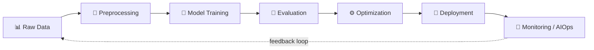

<h1 align="center">
  
</h1>

<p align="center">
  Just a beginner venturing into the world of AI with the <b>ambition</b> to understand it deeply and use it to <b>build amazing things.</b>
</p>

<p align="center">
  
  
</p>

---

## 🌐 About Me

```yaml
name: Thanh (thx2an)
role: Aspiring AI / ML Engineer

focus:
  - Algorithms & Optimization
  - Neural Networks & Deep Learning
  - End-to-End ML Systems (MLOps)

mindset:
  - Research-driven
  - Production-aware
  - Scalability-first

currently:
  - Building reproducible training pipelines
  - Learning to ship models, not just train them
```

---

## 🛠️ Tech Stack

### 🤖 AI / ML / DL
<p align="left">
  
  
  
  
  
  
  
</p>

### ⚙️ MLOps & Infra
<p align="left">
  
  
  
  
  
  
  
  
  
</p>

### 🔌 Backend / APIs
<p align="left">
  
  
  
  
</p>

### 🎨 Frontend
<p align="left">
  
  
  
  
</p>

---

## 🧪 How I Build ML Systems



## 🚀 What Sets Me Apart

- 🔬 Strong theoretical grounding + practical execution
- 🏗️ Comfortable bridging ML research → production engineering
- 📦 Clean architecture, reproducibility, and scalability
- 🔁 Thinks in feedback loops — monitoring and retraining, not just training

---

## 📈 GitHub Stats

<p align="center">
  
  
</p>

<p align="center">
  
</p>

<p align="center">
  
</p>

---

## 📡 Connect

<p align="center">
  <a href="https://github.com/thx2an"></a>
  <a href="https://www.facebook.com/7k.elevn/"></a>
</p>

<p align="center"><i>⚡ Building today the AI systems of tomorrow.</i></p>
